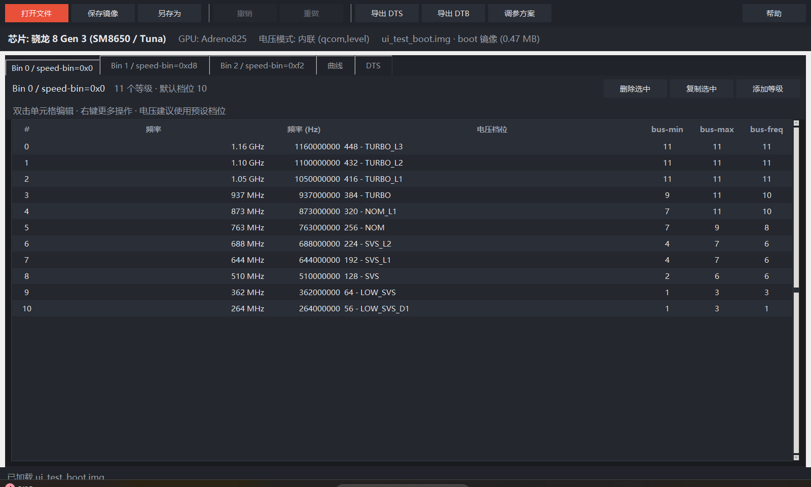
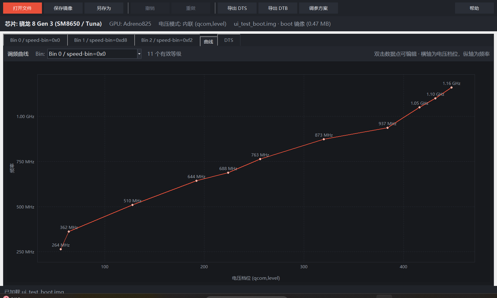

# KonaBess PC

**骁龙 GPU 频率 / 电压表桌面编辑器** —— 参考 [KonaBess Next](https://github.com/KonaBess-Next/KonaBess-Next) 重新实现的 Windows 电脑版。

在电脑上直接打开 `boot.img` / `vendor_boot.img` / `dtbo.img`，图形化编辑设备树中的 GPU 频率表与电压表，导出可刷入的镜像。无需 Root、无需手机端工具，也**不依赖** `magiskboot` / `dtc` 等外部命令。



## 功能特性

- **直接读写镜像**：自己实现 Android boot image（v0–v4）、vendor_boot（v3/v4）、DTBO 的解析与重组，只替换设备树数据，其余分区内容字节级原样保留
- **不依赖外部工具**：内置设备树二进制（FDT）解析器与 DTS 文本受限编译器，无需 `magiskboot` / `dtc`
- **自动识别**：打开文件后自动识别芯片型号、电压模式（内联电压 / 独立电压表）、speed bin 与等级列表
- **完整编辑能力**：
  - 修改频率（支持 `1160` / `1160MHz` / `1.16GHz` 等输入格式与快捷键微调）
  - 电压档位选择（预设档位列表 + 滑块 + 直接输入，自动显示 `448 - TURBO_L3` 这类名称）
  - 总线档位（bus-min / bus-max / bus-freq）编辑
  - 添加 / 复制 / 删除频率等级，自动维护 `qcom,initial-pwrlevel` 等指针
  - 独立电压表（OPP table）逐条编辑
- **调频曲线**：以电压为横轴、频率为纵轴可视化当前 bin，双击数据点即可编辑
- **撤销 / 重做**：完整的编辑历史（100 步）
- **调参方案**：可把整套频率/电压配置导出为 JSON 并与他人分享，或应用到其他设备
- **高 DPI 支持**：在 125% / 150% 缩放的显示器上清晰显示



## 快速开始

### 方式一：直接运行可执行文件（推荐）

1. 下载或构建 `dist/KonaBessPC.exe`（单文件，约 11 MB，无需安装 Python）
2. 双击运行，或把镜像文件拖到 exe 上

### 方式二：从源码运行

需要 Python 3.9+（自带的 tkinter 即可，无强制第三方依赖）：

```bat
run.bat
```

或者：

```bash
python main.py
```

可选安装压缩支持库（处理压缩内核中的内嵌 DTB，如骁龙 888）：

```bash
pip install lz4 zstandard
```

### 构建 exe

```powershell
powershell -ExecutionPolicy Bypass -File build_exe.ps1
```

## 使用指南

### 基本流程

1. **提取镜像**：从官方固件包（fastboot ROM）或手机中提取 `boot.img` / `vendor_boot.img` / `dtbo.img`
   - 大多数新机型（骁龙 8 Gen 2 及以后）的 GPU 调频数据在 `vendor_boot.img` 中
   - 骁龙 865 / 888 等机型可能在 `boot.img` 的 dtb 段或内核内嵌设备树中，程序会自动探测
2. **打开文件**：点击「打开文件」；若一个镜像中存在多个设备树，可在右上角切换
3. **编辑参数**：
   - 双击「频率」列 → 修改频率
   - 双击「电压档位」列 → 选择电压（建议使用预设档位）
   - 双击「总线」列 → 修改总线档位
   - 右键 → 添加 / 复制 / 删除等级
4. **保存镜像**：点击「保存镜像」生成 `boot_new.img` 等输出文件
5. **刷入设备**：

   ```bash
   fastboot flash boot boot_new.img
   # vendor_boot / dtbo 同理：
   fastboot flash vendor_boot vendor_boot_new.img
   fastboot flash dtbo dtbo_new.img
   ```

### 电压档位说明

- 数值是 Qualcomm RPMh **电压角（corner）编号**，数值越大电压越高
- **降压**（降低编号）可降低功耗与发热，但过低会导致 GPU 不稳定、花屏或死机，请逐档微调并充分测试
- **超频**时通常需要适当提高电压档位以保证稳定
- 程序会根据芯片型号自动匹配档位命名表（如 `384 - TURBO`、`448 - TURBO_L3`）

### 支持的芯片

| 系列 | 支持型号 |
|:---|:---|
| 骁龙 8 | 8 Elite Gen 5、8 Elite、8s Gen 4、8s Gen 3、8 Gen 3、8 Gen 2、8+ Gen 1、8 Gen 1、888、865、855 |
| 骁龙 7 | 7+ Gen 3、7+ Gen 2、7 Gen 1、780G、778G、765、750 |
| 骁龙 6 | 690 |

> 识别逻辑基于设备树内容动态探测，实际支持范围取决于设备树中是否存在标准结构的 GPU 频率表。

### 支持的输入格式

| 格式 | 说明 |
|:---|:---|
| `boot.img` | Android boot image v0 / v1 / v2 / v3 / v4（dtb 段或内核内嵌 DTB） |
| `vendor_boot.img` | Android vendor_boot v3 / v4（含 ramdisk 表与 fragment） |
| `dtbo.img` | DTBO 表格式与纯拼接格式 |
| `.dtb` | 独立设备树二进制（支持多 DTB 拼接文件） |
| `.dts` | DTS 文本（支持 dtc 反编译输出级别的语法） |

## 工作原理

与手机版依赖 `magiskboot` 解包镜像、`dtc` 反编译/编译设备树不同，电脑版**直接以设备树二进制（FDT）的方式工作**：

```
打开镜像
  ├─ 解析镜像 header，定位 dtb 段 / 内核内嵌 DTB / dtbo 条目
  ├─ 解析 FDT（结构块 / 字符串块）为节点树
  └─ 从节点树中读取 GPU 频率表（qcom,gpu-pwrlevel-bins）与电压表（opp-table）

编辑参数
  └─ 直接修改节点属性数据（原始字节长度保持，写入大端整数）

保存镜像
  ├─ 序列化 FDT（未修改的节点与属性保持原顺序）
  ├─ 替换镜像中的对应数据段
  └─ 重新按页对齐布局并回填 header 字段
```

由于只替换设备树数据，压缩的 kernel / ramdisk 等内容完全不需要解压，避免了压缩格式兼容问题；仅在内核内嵌 DTB（DTB 位于压缩内核尾部）场景下需要解压与重压缩内核。

## 项目结构

```
konabess/              核心引擎（无界面依赖，可独立使用）
  fdt.py               FDT 设备树二进制解析与序列化
  bootimg.py           boot / vendor_boot / dtbo 镜像解析与重组
  kernel_dtb.py        内核内嵌 DTB 的处理
  compression.py       gzip / lz4 / zstd / xz 压缩支持
  dts.py               DTS 文本受限编译与生成
  chips.py             芯片识别与电压档位预设表
  gpu_table.py         GPU 频率/电压表模型与编辑操作
  workspace.py         编辑会话（打开/编辑/撤销/保存）
ui/                    图形界面（tkinter）
tests/
  test_engine.py       引擎端到端测试（含真实 DTS 数据）
  test_ui.py           界面冒烟测试
  screenshot.py        界面截图（开发用）
```

运行测试：

```bash
python tests/test_engine.py   # 引擎测试（需要 _reference 中的测试数据）
python tests/test_ui.py       # 界面冒烟测试
```

## 免责声明

**修改系统文件与超频 / 降压存在固有风险。** 开发者不对因使用本工具导致的设备损坏、数据丢失或系统不稳定承担责任。修改前请务必：

- 备份原始镜像，确认设备可正常进入 fastboot 模式
- 一次只做小幅调整，充分测试后再继续
- 刷入修改镜像需要已解锁 Bootloader

## 致谢

- **KonaBess 原作者**：[libxzr](https://github.com/libxzr) —— 原始创意与实现
- **KonaBess Next**：[KonaBess-Next/KonaBess-Next](https://github.com/KonaBess-Next/KonaBess-Next) —— 本项目的参考实现（电压档位表、芯片识别逻辑、编辑模型均参考自该项目）
